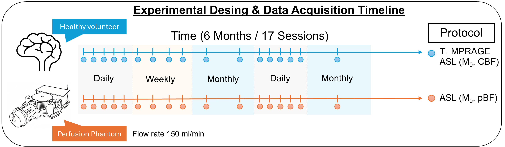
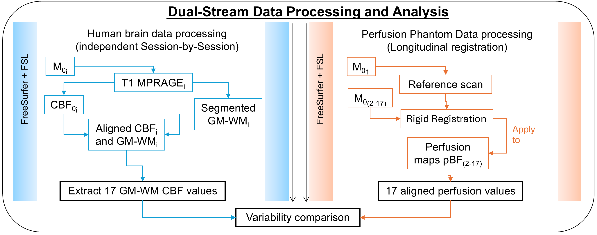

# ASL-Variability-MRI
Pipeline Code to: 
1. Sort DICOM images with DICOM sort.
2. Convert DICOM images to .nii.
3. [**Human**]: 
    - Use Freesurfer to create a 3D map of the brain.
    - Use FSL to register ASL and M0 images with the Freesurfer output. 
4. [**QASPER**]:
    - Use FSL to register ASL and M0 images.
5. Compare perfusion values for **Human** and **QASPER** in different sessions using Python.

## Requirements
1) [FSL - FMRIB Software Library](https://fsl.fmrib.ox.ac.uk/fsl/docs/) and [FreeSurfer](https://surfer.nmr.mgh.harvard.edu/fswiki).
2) [DICOM Sort](https://dicomsort.com/).
3) Software to convert DICOM to NIfTI ([suggested](https://www.nitrc.org/plugins/mwiki/index.php/dcm2nii:MainPage)).
4) Python/Jupyter Notebook.
5) Suggested: use [Neurodesk](https://neurodesk.org/).

## Experiment Setup

## Human Pipeline ##
Deface step:
```sh
mri_deface T1_mprage_SX.nii   talairach_mixed_with_skull.gca   face.gca   t1_mprage_defaced_SX.nii
```
```recon-all```: Creates a 3D map of the brain, identifying where gray and white matter are located (using the T1_mprage as input).

```sh
recon-all -s subject1_0X -i T1_mprage_sX.nii -all
```
```mri_convert``` Changes file formats so different software programs can read the brain maps.
```sh
mri_convert subject1_0X/mri/brain.mgz subject1_0X/mri/brain.nii.gz
```
```flirt``` Performs an initial "rough" alignment to get the ASL and T1 images into the same neighborhood.
```sh
flirt -in subject1_0X/M0X.nii -ref subject1_0X/mri/brain.nii.gz -omat subject1_0X/init1.mat -dof 6 -cost mutualinfo
```
```bbregister``` Fine-tunes the alignment by matching the ASL image specifically to the boundary between gray and white matter.
```sh
bbregister --s subject1_0X --mov subject1_0X/M0X.nii --reg subject1_0X/initX.mat --o subject1_0X/cM0X.nii.gz --t2
```
```lta_convert``` Translates the alignment "instructions" into a format FreeSurfer understands.
```sh
lta_convert --inreg subject1_0X/initX.mat --src subject1_0X/M0X.nii --trg subject1_0X/mri/T1.mgz --outlta subject1_0X/fmriX_to_T1.lta
```
```mri_vol2vol``` Moves the ASL data into the T1 anatomical space using those alignment instructions
```sh
mri_vol2vol --mov subject1_0X/ASLX.nii --targ subject1_0X/mri/T1.mgz --lta subject1_0X/fmriX_to_T1.lta  --o subject1_0X/cASLX.nii.gz --interp trilinear
```
```mri_convert``` Exports the final tissue segmentation (the labels for GM/WM) into a standard format for data extraction.
```sh
mri_convert subject1_0X/mri/aseg.mgz subject1_0X/asegX.nii.gz
```
## QASPER Pipeline ##

```flirt``` (Step 1): Compares the "calibration" image from the X session to the first session to calculate exactly how the subject's “head” moved (the "map" of the shift).
```sh
flirt -in ScanX/M0X.nii -ref Scan1/M01.nii -omat ScanX/scanX_to_scan1.mat -dof 6 -out ScanX/cM0X.nii.gz
```

```flirt``` (Step 2): Uses that "map" to physically move the actual perfusion (ASL) data from the X session so it overlaps perfectly with the first session.
```sh
flirt -in ScanX/ASLX.nii -ref Scan1/M01.nii -applyxfm -init ScanX/scanX_to_scan1.mat -out ScanX/cASLX.nii.gz
```
## Pipeline Summary
